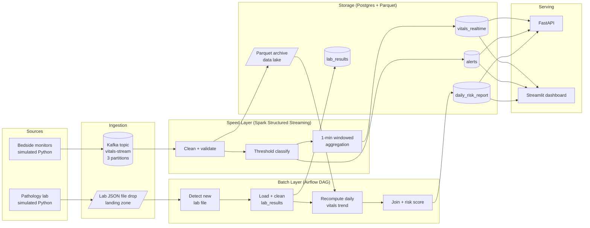

# Hospital Patient Vital Signs Monitoring — A Lambda Architecture Data Pipeline

**Applied Big Data Engineering — Mini Project Report**

*Team members: [NAME 1], [NAME 2], [NAME 3]*
*Repository: [GIT REPO LINK]*
*Demo video: [LINK]*

> **Note to team**: this draft has the architecture/justification/observability
> sections written out in full since those don't depend on your specific run of the
> system. Sections marked `[TODO: screenshot]` / `[TODO: fill in]` need your actual
> output once the pipeline has been running for a while — take screenshots from the
> Streamlit dashboard, Grafana, Airflow UI, and Alertmanager as described inline.
> Convert this to PDF at the end (Pandoc, or paste into Word/Google Docs and export).

---

## 1. Introduction and Business Requirements

### 1.1 Use case

We implemented **Use Case 2: Hospital Patient Vital Signs Monitoring**. A hospital ward
needs two things at once:

1. **Continuous, near-real-time visibility** into bedside monitor readings (heart rate,
   SpO2, blood pressure, temperature) for every patient currently on the ward, with
   immediate alerting when a reading crosses a clinically meaningful threshold.
2. **A daily reconciliation** of each patient's vitals trend against that day's lab
   results (delivered once per day by the pathology lab as a batch extract), producing
   an updated risk assessment per patient.

### 1.2 Business question this system answers

> *Which patients show concerning vital-sign trends right now, and how do yesterday's
> lab results change the risk picture for those patients going forward?*

This decomposes into two sub-questions that map directly onto our two processing paths:

- **"Right now"** → requires a low-latency streaming path (the *speed layer*): ingest
  vitals continuously, classify each reading against clinical thresholds, and surface
  breaches within seconds, not hours.
- **"How do yesterday's labs change the picture"** → requires a batch reconciliation
  path (the *batch layer*): join a full day's vitals history against that day's lab
  panel, which only exists once daily, and produce a scored, explainable output.

### 1.3 Data sources (simulated)

| Source | Cadence | Fields | Simulated as |
|---|---|---|---|
| Bedside monitors | every ~3s per patient (real continuous time, not compressed) | `patient_id, heart_rate, spo2, systolic_bp, diastolic_bp, temperature, timestamp` | `sources/vitals_producer.py` → Kafka |
| Pathology lab | once per simulated day | `patient_id, test_type, result_value, reference_low/high, collected_at` | `sources/lab_batch_source.py` → JSON file drop |

`NUM_PATIENTS` simulated ward patients (default 12) are modeled with per-patient
baseline vitals that drift via a bounded random walk, with an injected-abnormal-spike
probability (`ABNORMAL_SPIKE_PROBABILITY`, default 6% of readings) so the alerting and
risk-scoring paths are genuinely exercised rather than always seeing "normal" data.

---

## 2. Architecture Decision: Lambda vs. Kappa

### 2.1 The two candidates

**Kappa architecture** treats a single, replayable, append-only log (Kafka) as the one
source of truth for both real-time and "batch" processing: there is no separate batch
layer — historical/corrected results are produced by *replaying* the log through the
same streaming engine, not by materializing a second store and running a different kind
of job over it.

**Lambda architecture** maintains two separate processing paths against an immutable
raw data set: a **speed layer** optimized for low latency (approximate, fast,
continuously updated) and a **batch layer** optimized for correctness (recomputes from
scratch on a schedule, slower, authoritative), merged at a serving layer.

### 2.2 Why Lambda fits this use case better than Kappa

We evaluated the decision against four dimensions, as the rubric requires:

**Latency requirements.** Vitals alerting genuinely needs sub-minute latency — a
patient's SpO2 dropping below 90% is not useful information five minutes late. This
argues for *some* stream-processing speed layer regardless of the overall architecture
choice; it does not, by itself, argue for Lambda over Kappa.

**Replay / reprocessing requirements — the deciding factor.** Kappa's core premise is
that *all* input data is a stream, and that reprocessing = replaying that stream from
an earlier offset through the same streaming job. That premise holds naturally when
your "batch" source really is just delayed or re-ingested stream data (e.g., replaying
a day's worth of clickstream events to fix a bug in a stream job). It does **not** hold
naturally here: the lab results feed is not vitals data that arrived late — it is a
*structurally different* daily extract from an entirely separate system (the pathology
lab), with its own schema, its own once-a-day cadence, and no meaningful Kafka offset to
"replay" from. Forcing it through Kafka and a Kappa-style unified stream processor would
mean either (a) publishing the whole daily lab file as a burst of Kafka messages once a
day purely to satisfy the Kappa pattern, which buys nothing over just reading the file,
or (b) writing an entirely different code path inside the "unified" streaming job to
handle it — at which point we no longer have a unified processing model anyway, and have
recreated the Lambda split with extra Kafka machinery in between. Lambda is the honest
description of what the system actually does: two genuinely different processing
paradigms (continuous stream aggregation vs. scheduled batch reconciliation) for two
genuinely different kinds of sources.

**Consistency requirements.** The daily risk report must be **reproducible and
auditable** — if a clinician asks "why was this patient flagged high-risk yesterday,"
we need to be able to recompute that exact result from the immutable vitals archive and
the lab file, deterministically, independent of what the (approximate, continuously
overwritten) speed-layer aggregates say *right now*. Lambda's batch layer is built for
exactly this: recompute-from-raw-data determinism. The speed layer's `vitals_realtime`
table, by contrast, is explicitly a fast/approximate view (1-minute tumbling windows
with a 30-second watermark) that we intentionally allow to be superseded — that
inconsistency between the two layers is a known, accepted Lambda trade-off, not a bug.

**Cost / operational complexity.** Kappa's operational advantage is *one* processing
paradigm to run, monitor, and reason about instead of two. That is a real cost, and we
acknowledge it (see §7). But at this project's scale, running both Spark Structured
Streaming (speed layer) and Airflow-orchestrated batch jobs (batch layer) is well within
scope for a Docker Compose deployment, and the operational simplicity Kappa would buy us
does not outweigh the architectural mismatch described above.

### 2.3 Rejected alternative: pure Kappa

We explicitly considered a Kappa design where both vitals and lab results are published
to Kafka topics and a single Spark Structured Streaming application handles both —
using a large-window/session-based join for the daily reconciliation instead of a
separate Airflow batch job. We rejected it because:

1. The lab source is inherently daily-batch, not streaming — publishing it to Kafka
   would be ingesting-a-file-as-a-stream theater, not a real streaming source.
2. A "replay from Kafka" recovery story is not needed for a daily reference feed — we
   can always just re-read the source file, so Kappa's headline advantage (arbitrary
   reprocessing via log replay) is not something this data source benefits from.
3. Auditable, deterministic daily reconciliation is much more naturally expressed as a
   scheduled, retryable, dependency-aware Airflow DAG (with clear task boundaries: load
   → recompute → join → score → write) than as stateful streaming joins with long
   watermarks, which would also make the Learning Outcome around orchestration
   (Airflow) impossible to demonstrate.

### 2.4 Resulting architecture

The Parquet archive is the architectural pivot: it is the *immutable raw log* that the
batch layer recomputes from, materialized independently of Kafka's own retention. This
is what makes the system Lambda rather than Kappa — the batch layer does not replay the
Kafka topic; it recomputes from a purpose-built batch-friendly store, exactly as Lambda
prescribes.

---

## 3. Technology Stack and Justification

| Layer | Technology | Why this, for this use case |
|---|---|---|
| Ingestion | **Apache Kafka** (KRaft mode, 3 partitions on `vitals-stream`) | Durable, replayable buffer between many concurrent bedside-monitor producers and the streaming consumer; partitioning by `patient_id` preserves per-patient ordering while allowing parallel consumption. KRaft mode (no ZooKeeper) reflects current Kafka deployment practice and simplifies the compose stack. |
| Stream processing | **Apache Spark Structured Streaming** | Native Kafka source connector, built-in watermarking for late data, and a DataFrame API that makes windowed aggregation + `foreachBatch` JDBC upserts straightforward. Chosen over Storm because our transformations (windowed averages, threshold classification, Parquet archival) are naturally expressed as DataFrame operations, and because the same Spark skill set is reused for structured batch-style analysis if the batch layer needs to scale up later. |
| Orchestration | **Apache Airflow** | The batch layer is a multi-step, dependency-ordered, retryable pipeline (detect file → load → recompute → join → score → write) — exactly Airflow's design target. Its scheduler naturally expresses "once per simulated day," its UI gives visible DAG run history for the demo/viva, and its retry semantics give us resilience for free if a step transiently fails (e.g., Postgres briefly unavailable). |
| Storage/Sink | **PostgreSQL** (serving tables) + **Parquet on a local volume** (raw archive, standing in for HDFS/S3) | Postgres: the serving-layer outputs (`vitals_realtime`, `alerts`, `lab_results`, `daily_risk_report`) are all small, structured, query-by-key workloads — a perfect fit for a relational store queried by the API/dashboard, and `ON CONFLICT` upserts give us idempotent writes for free. Parquet: columnar, splittable, and the standard format for a batch-recompute data lake; a local volume substitutes for HDFS/S3 at this scale without changing the access pattern (`pandas.read_parquet` today, `spark.read.parquet` unchanged if migrated to real HDFS/S3). |
| Serving | **FastAPI** + **Streamlit** | FastAPI matches the brief's suggested "API endpoint" deliverable exactly, gives us `/metrics` for free via `prometheus-fastapi-instrumentator`, and is trivial to extend. Streamlit gives a fast, Python-native, live-refreshing dashboard for the human-facing consolidated report without a separate frontend build step — appropriate for a 2-week project. |
| Observability | **Prometheus + Pushgateway + Alertmanager + Grafana** | Industry-standard metrics stack. Pushgateway bridges the gap for our batch/short-lived components (producer loop, Spark micro-batches, Airflow tasks) that can't be scraped directly; the API is scraped natively since it's a long-running HTTP service. Alertmanager gives us real alert routing/grouping rather than ad hoc log-grepping. Grafana provides the visual dashboard the rubric explicitly rewards. |

---

## 4. Processing Logic (What Each Layer Actually Computes)

### 4.1 Speed layer (`streaming/vitals_stream_processor.py`)

1. **Clean/validate**: parse the Kafka JSON payload against an explicit schema, drop
   any reading with physiologically impossible values (e.g. heart rate outside 0–300).
2. **Threshold classification**: each reading is scored against clinically-inspired
   thresholds (`common/vitals_rules.py`) into `normal` / `warning` / `critical`, with
   the breaching metric and reason recorded. This module is pure Python (no Spark
   dependency) and is unit-tested directly (`tests/test_vitals_rules.py`).
3. **Windowed aggregation**: 1-minute tumbling windows per patient (30-second
   watermark for late data) computing average vitals, reading count, and abnormal
   count — written to `vitals_realtime` via an upsert (`foreachBatch` + `ON CONFLICT`).
4. **Alerting**: any `warning`/`critical` reading is written immediately (10-second
   micro-batch trigger) to the append-only `alerts` table.
5. **Archival**: every valid raw reading is also written to the Parquet data lake,
   partitioned by `event_date` — this is the batch layer's input.

### 4.2 Batch layer (`airflow/dags/daily_risk_report_dag.py`)

1. **Detect** the oldest lab file dropped that hasn't yet produced a `daily_risk_report`
   row for its `batch_date` (soft-skips the run via `AirflowSkipException` if nothing
   new — no wasted work).
2. **Load + clean**: parse the day's lab JSON, flag `is_out_of_range` per result against
   its reference range, upsert into `lab_results`.
3. **Recompute vitals trend**: re-read that day's partition of the Parquet archive
   (**not** the Kafka topic — the Lambda distinction) and compute, per patient:
   abnormal-reading ratio, max heart rate, min SpO2, max systolic BP, and a
   worsening/stable/improving trend (first-half-of-day vs. second-half-of-day abnormal
   ratio) — `common/risk_scoring.py::compute_daily_trend`.
4. **Join**: combine the recomputed vitals trend with that day's out-of-range lab tests
   for the same patient.
5. **Score**: weighted risk score (0–100) — base score from abnormal-reading ratio,
   bonuses for dangerously low SpO2 / high heart rate / high systolic BP, bonuses per
   flagged lab test (extra weight for clinically acute tests: troponin, potassium,
   creatinine, WBC count), and a trend adjustment (+10 worsening, −5 improving) — mapped
   to `low` / `medium` / `high` / `critical` — `common/risk_scoring.py::compute_risk`.
   This is the "meaningful transformation... join between the two sources" the rubric
   asks for, and it is unit-tested directly (`tests/test_risk_scoring.py`, 8 cases).
6. **Write**: upsert into `daily_risk_report`, keyed on `(patient_id, batch_date)` — the
   Lambda serving-layer merge point alongside `vitals_realtime`.

---

## 5. Observability Design

| What | How | Why |
|---|---|---|
| Structured logging | Every component (`common/logging_config.py`) logs JSON objects (`stage`, `level`, `message`, plus contextual fields) to stdout, captured by Docker | Machine-parseable logs across ingestion/processing/storage stages, satisfying the "structured logging across ingestion, processing, and storage stages" requirement directly, and greppable/aggregable if piped to a real log system later. |
| Metrics: push-based | `common/metrics.py` pushes counters/gauges to Pushgateway from the vitals producer (events sent, errors, last-tick timestamp), the lab source (files dropped, last-drop timestamp), and the Spark job (alerts written, realtime windows written, per-batch timestamps) | These components are short-lived/batch/periodic — not long-running HTTP servers — so push-to-gateway is the correct Prometheus pattern rather than trying to scrape them. |
| Metrics: pull-based | The FastAPI service exposes `/metrics` natively via `prometheus-fastapi-instrumentator` (request counts, latencies, status codes) | Long-running HTTP service → scraped directly, the standard Prometheus pattern. |
| Health check | Every component also writes a heartbeat row to `pipeline_health` (Postgres) on success; the API's `/health` endpoint reports staleness per stage against a per-stage expected cadence | Gives a simple, dependency-free health signal usable by the dashboard, a load balancer, or a demo `curl`, independent of whether Prometheus itself is up. |
| Alert rules | `observability/alert_rules.yml`, evaluated by Prometheus, routed through Alertmanager (`observability/alertmanager.yml`) | See §5.1 below — satisfies "at least one basic alert or health-check rule," we implemented five. |
| Dashboards | Grafana, auto-provisioned from `observability/grafana/` (datasource + dashboard JSON) | Visual, at-a-glance pipeline health for the demo/viva — ingestion rate, processing lag, alert rate, batch freshness, API traffic. |

### 5.1 Alert rules implemented

1. **`VitalsIngestionStalled`** — fires if no vitals producer heartbeat for >2 minutes.
   Directly implements the brief's example ("no data received in N minutes").
2. **`SparkStreamingStalled`** — fires if the speed layer hasn't produced a windowed
   aggregate in >2 minutes (distinguishes "producer is fine, Spark job died" from #1).
3. **`HighAbnormalVitalsRate`** — fires if the sustained rate of threshold-breach alerts
   exceeds 0.5/sec over 5 minutes, sustained for 2 minutes — a proxy for either a
   systemic monitoring fault or a genuine ward-wide event worth investigating.
4. **`BatchJobOverdue`** — fires if the daily lab file hasn't been dropped within ~3x
   the expected simulated-day interval, so the batch layer's staleness is visible
   independent of Airflow's own UI.
5. **`ErrorRateElevated`** — fires if the vitals producer accumulates >5 Kafka send
   errors in 5 minutes (implements the brief's second example, "error rate above
   threshold").

`[TODO: screenshot]` Prometheus → Alerts page showing all 5 rules in "green"/inactive
state during normal operation.

`[TODO: screenshot]` Trigger `VitalsIngestionStalled` for real: `docker compose stop
vitals-producer`, wait ~2 minutes, screenshot the alert firing in both Prometheus and
Alertmanager, then `docker compose start vitals-producer` and screenshot it resolving.

---

## 6. Results

`[TODO: screenshot]` Streamlit dashboard — live ward view with several patients, at
least one in `warning`/`critical` status (wait for a spike or lower
`ABNORMAL_SPIKE_PROBABILITY`'s denominator / just let it run — expected roughly every
`1 / (NUM_PATIENTS × ABNORMAL_SPIKE_PROBABILITY / VITALS_INTERVAL_SECONDS)` seconds).

`[TODO: screenshot]` Streamlit dashboard — daily risk report table for at least one
`batch_date`, sorted by risk score, with the bar chart.

`[TODO: screenshot]` `GET /ward/status` and `GET /patient/{id}/risk` responses from
`http://localhost:8000/docs` (Swagger "Try it out").

`[TODO: screenshot]` Airflow UI — `daily_risk_report_dag` graph view and at least one
successful run's task log for `compute_and_write_risk_report`.

`[TODO: screenshot]` Grafana dashboard with populated panels (let the stack run for a
few minutes first so the time series have data).

`[TODO: fill in]` One or two paragraphs narrating what the above screenshots show in
your specific run — e.g. "Patient P004 was flagged `critical` at 14:32 after SpO2 fell
to 87%; the alert appears in the dashboard's alert feed at 14:32:xx and in the
`alerts` table. The following day's risk report shows P004 at risk_score=78
(`critical`), driven by a 0.34 abnormal-reading ratio plus an out-of-range troponin
result."

---

## 7. Limitations, Trade-offs, and Production-Scale Changes

- **Airflow execution mode.** We run `airflow standalone` (SQLite metadata DB,
  SequentialExecutor) for deployment simplicity. This means Airflow's own DAG-run
  history is not durable across a full `docker compose down` (though it survives
  `stop`/`start`), and only one task runs at a time. At production scale we would run
  CeleryExecutor (or KubernetesExecutor) against a dedicated Postgres metadata database,
  separate from the application database, with multiple workers.
- **Batch-layer compute engine.** The daily recompute step uses pandas over the Parquet
  archive rather than a distributed `spark-submit` batch job. At our data volume (a
  handful of patients, a few hundred KB of Parquet per simulated day) this is
  appropriate and keeps the Airflow image lightweight; at real hospital scale (hundreds
  of beds, months of retained history) this step should become its own Spark batch job,
  reusing the same `common/risk_scoring.py` logic unchanged since it has no Spark
  dependency.
- **Single-broker Kafka, single Postgres instance.** No replication, no failover. A
  production deployment needs a multi-broker Kafka cluster (replication factor ≥3) and
  a managed/replicated Postgres (or a purpose-built time-series store such as
  TimescaleDB for `vitals_realtime`'s write pattern).
- **Threshold-based alerting only.** Our vital-sign thresholds (`common/vitals_rules.py`)
  are deliberately simplified and are **not** real medical guidance. A production system
  would use per-patient personalized baselines and clinician-configurable thresholds,
  not fixed population-wide cutoffs.
- **Simulated clock compression.** `SIMULATED_DAY_SECONDS=300` means our "daily" batch
  cadence is artificially fast for demo purposes; the architecture and code make no
  assumption about the actual value, so this is purely a config change for a real
  deployment (`SIMULATED_DAY_SECONDS=86400`, and the Airflow cron schedule derives from
  it automatically).
- **Alertmanager receiver.** We use a null/log receiver for demo purposes; production
  would route to PagerDuty/email/Slack per severity.

---

## 8. Assumptions and Simplifications

- One simulated day = 300 real seconds (5 minutes); vitals stream runs in real
  continuous time (not compressed).
- 12 simulated ward patients by default (`NUM_PATIENTS`), each with independently
  drifting baseline vitals and a per-reading 6% chance of an injected abnormal spike.
- Lab panel: each patient receives a random subset (3 to 7) of 7 possible tests per
  simulated day, each with its own reference range and abnormal-result probability.
- "Reconciliation" is at the granularity of one row per `(patient_id, batch_date)` in
  `daily_risk_report` — we do not model partial/late-arriving lab results within a day.
- No authentication/authorization on the API or dashboard — out of scope for this
  project, would be required before any real clinical use.

---

## 9. Individual Contributions

`[TODO: fill in per your team]`

| Member | Contribution |
|---|---|
| [Name 1] | e.g. Kafka + Spark speed layer, alert rules |
| [Name 2] | e.g. Airflow batch layer, risk scoring logic, tests |
| [Name 3] | e.g. API, dashboard, Grafana/Prometheus observability, report |

---

## Appendix A: Schema

See `common/schema.sql` for full DDL. Summary:

- `vitals_realtime` — one row per patient, upserted every ~20s (speed layer).
- `alerts` — append-only threshold-breach log (speed layer).
- `lab_results` — daily lab results, unique per `(patient_id, test_type, batch_date)`.
- `daily_risk_report` — one row per `(patient_id, batch_date)`, the Lambda merge point.
- `pipeline_health` — one row per pipeline stage, used by `/health` and alert rules.
